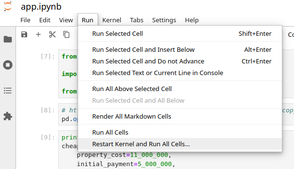

# Ипотечный калькулятор

## Чем может быть полезен скриптовый калькулятор

- Сравнение множества похожих вариантов, отличающихся 1-2 параметрами. Без необходимости вводить
  исходные данные несколько раз.
- Результаты расчёта всех вариантов отображаются друг под другом без необходимости
  переключения между вкладками.
- Можно настроить формат вывода под себя.
- Считать более сложные варианты, например, поэтапную схему как показано в примере
  использования. Для этого надо добавить всего одну переменную - стоимость
  промежуточного жилья.
- Сохранять исходные данные расчётов и по одному клику получать новый расчёт всех
  вариантов. Может быть актуально если, например, поменялась ставка. Тогда можно
  пересчитать все варианты жилья изменив процентную ставку только один раз в одном
  месте.
- Понимать как устроена ипотека изнутри.
- Меньше тыкать мышью. Если вам как и мне больше нравится работать с клавиатуры.

## Запуск

Код можно запустить прямо в браузере:
[](https://mybinder.org/v2/gh/Zaynulla/mortgage/main?labpath=app.ipynb)

Рекомендуется пересчитывать сразу все ячейки, так код гарантированно будет выполнен
сверху вниз, в отличие от перезапуска расчёта ячеек в произвольном порядке.



## Использование

### Рассмотрим вариант покупки "базовая вторичка"

```python
print("Базовая вторичка")
cheap_ugly_second_hand = Mortgage(
    property_cost=10_000_000,
    initial_payment=5_000_000,
    annual_interest_rate_percent=15.0,
    amortization_period_years=30,
    actual_monthly_payment=100_000,
    # payments_reducing_duration={7: 520_000},
    payments_reducing_payment={7: 520_000},
)
cheap_ugly_second_hand.print_mortgage_main_info()
```

Здесь задаём стоимость жилья, первоначальный взнос, процентную ставку, срок ипотеки,
планируемый фактический ежемесячный платёж, который должен быть больше либо равен
обязательного, и разовые дополнительные досрочные погашения в отдельные месяцы.
Например, в 7-м месяце можно получить вычет 520 тысяч и потратить его на досрочное
погашение.

Результат получаем в виде текста с краткой информацией о параметрах ипотеки:

```text
Базовая вторичка
Ипотека будет выплачена за 5 лет 8 мес.
Стоимость недвижимости 10 000 000
Первоначальный взнос 5 000 000
Процентная ставка 15.0%
Начальный срок ипотеки 30
Планируемый ежемесячный платеж 100 000
Планируемые разовые платежи снижающие срок:

Планируемые разовые платежи снижающие платёж:
    7 мес: 520 000
```

и таблицы:

| Полных лет | Обязательный платёж |
| ---------- | ------------------- |
| 1          | 50 127              |
| 2          | 41 924              |
| 3          | 32 403              |
| 4          | 21 351              |
| 5          | 8 522               |

В таблице выводится обязательный платёж по прошествии соответствующего полного
количества лет. Здесь представлен предельно краткий формат вывода, без разбивки по
месяцам, без копеек в суммах платежей и т.д. Если вам интересно посмотреть больше
информации, можете адаптировать формат вывода под себя в методе
`print_mortgage_main_info()`.

### Добавим в сравнение вариант "приемлемая вторичка"

А что если теперь мы захотим сравнить с вариантом покупки более дорогой квартиры, но при
этом сохранить предыдущий результат для сравнения? Тогда в новый объект
`well_enough_second_hand` можно скопировать объект `cheap_ugly_second_hand`, но поменять
параметр "стоимость недвижимости":

```python
print("Приемлемая вторичка")

well_enough_second_hand = replace(
    cheap_ugly_second_hand,
    property_cost=13_000_000,
)

well_enough_second_hand.print_mortgage_main_info()
```

Можем посчитать и более сложный вариант - покупка той же приемлемой вторички, но после
окончания выплаты ипотеки для более дешёвой базовой вторички:

```python
print("Приемлемая вторичка после продажи базовой вторички")

well_enough_after_ugly = replace(
    well_enough_second_hand,
    initial_payment=cheap_ugly_second_hand.property_cost,
    occasional_payments_reducing_period={}, # на втором этапе не получаем льготу
)

well_enough_after_ugly.print_mortgage_main_info()
```

Здесь нам пришлось поменять уже несколько параметров, т.к. вычетов в последующей ипотеке
уже не предполагается, а первоначальный взнос будет равен стоимости базовой вторички.
Конечно, к моменту покупки следующего жилья на рынке многое поменяется: ставка,
стоимость жилья, зарплаты. Но для простоты считается, что совокупность факторов будет
эквивалентна сегодняшнему дню.

### И довершим сравнение IT-ипотекой

```python
print("IT-ипотека")

it_mortgage_slavery = replace(
    cheap_ugly_second_hand,
    property_cost=20_000_000,
    annual_interest_rate=0.046,
)

it_mortgage_slavery.print_mortgage_main_info()
```

Здесь меняется стоимость жилья и процентная ставка, а вычеты остаются такие же, их не
меняем.

Если вдруг мы решим отложить побольше денег в резерв или, наоборот, увеличить первоначальный взнос, или банк поменял ставку, или изменилась стоимость объекта, или мы поняли что ежемесячный платеж должен быть другой и так далее, то достаточно внести изменение только в одном месте и вся цепочка расчётов для всех объектов обновится.
